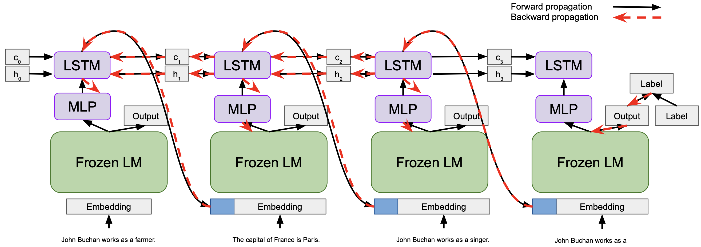

# MemoryPrompt
This repository gathers the data and code for the paper [MemoryPrompt: A Light Wrapper to Improve Context Tracking in Pre-trained Language Models](https://arxiv.org/pdf/2402.15268v1.pdf). 

You can download the fact-updating datasets [here](https://drive.google.com/drive/folders/1B9NzlRrekIhtJlC4IPR1XiJ-63uRU7ph?usp=sharing).

## Citation

    @article{rakotonirina2024memoryprompt,
        title={MemoryPrompt: A Light Wrapper to Improve Context Tracking in Pre-trained Language Models},
        author={Rakotonirina, Nathana{\"e}l Carraz and Baroni, Marco},
        journal={arXiv preprint arXiv:2402.15268},
        year={2024}
      }
